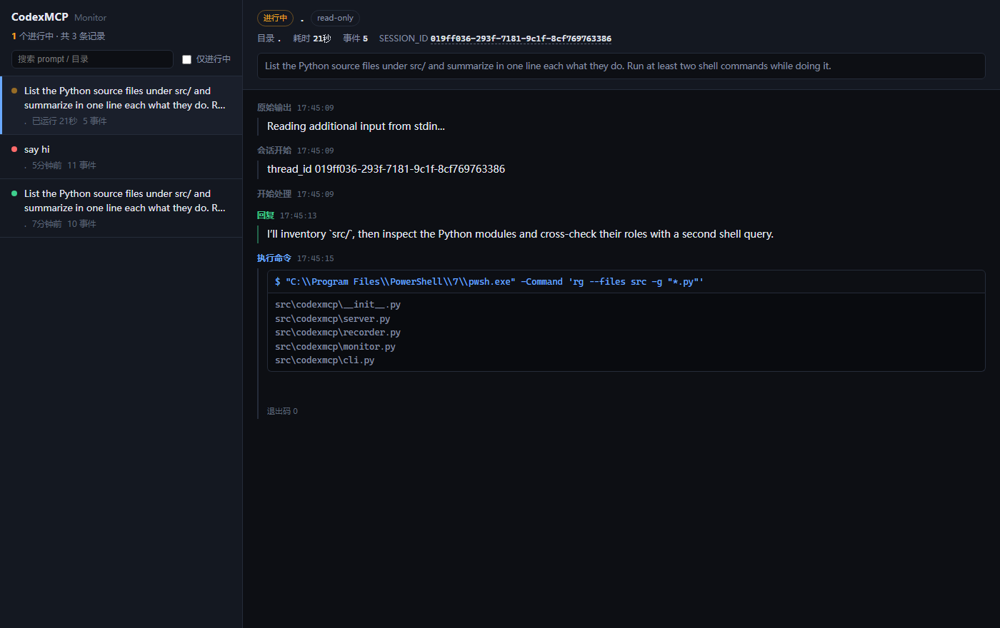

<div align="center">


**Seamlessly Bridge Claude Code and Codex**

[](https://opensource.org/licenses/MIT) [](https://www.python.org/downloads/) [](https://modelcontextprotocol.io)[](https://x.com/intent/tweet?text=CodexMCP：Seamlessly%20bridge%20Claude%20Code%20and%20Codex%20https://github.com/GuDaStudio/codexmcp%20%23AI%20%23Coding%20%23MCP) [](https://www.facebook.com/sharer/sharer.php?u=https://github.com/GuDaStudio/codexmcp) [](https://www.reddit.com/submit?title=CodexMCP：Seamlessly%20bridge%20Claude%20Code%20and%20Codex&url=https://github.com/GuDaStudio/codexmcp) [](https://t.me/share/url?url=https://github.com/GuDaStudio/codexmcp&text=CodexMCP：Seamlessly%20bridge%20Claude%20Code%20and%20Codex)


⭐ Star us on GitHub — Your support means the world! 🙏😊

English | [简体中文](../README.md)

</div>

---

## I. Introduction

In today's AI-assisted programming landscape, **Claude Code** excels at architectural design and high-level thinking, while **Codex** demonstrates exceptional prowess in code generation and granular optimization. **CodexMCP** serves as the bridge between them, leveraging the MCP protocol to create powerful synergies:

- **Claude Code**: Requirements analysis, architectural planning, code refactoring
- **Codex**: Algorithm implementation, bug localization, code review
- **CodexMCP**: Session context management, multi-turn conversations, parallel task execution

Compared to the official Codex MCP implementation, CodexMCP introduces enterprise-grade features including **session persistence**, **parallel execution**, and **reasoning trace tracking**, enabling smarter and more efficient collaboration between AI programming assistants. Feature comparison at a glance:


| Feature | Official Version | CodexMCP |
|---------|------------------|----------|
| Basic Codex Invocation | √ | √ |
| Multi-turn Conversations | × | √ |
| Reasoning Detail Tracking | × | √ |
| Parallel Task Support | ×  | √  |
| Error Handling | ×  | √  |
| Live Run Monitoring (web dashboard) | ×  | √  |


---

## II. Quick Start

### 0. Prerequisites

Please ensure you have successfully **installed** and **configured** both Claude Code and Codex.
- [Claude Code Installation Guide](https://docs.claude.com/docs/claude-code)
- [Codex CLI Installation Guide](https://developers.openai.com/codex/quickstart)


Please ensure you have successfully installed the [uv tool](https://docs.astral.sh/uv/getting-started/installation/):

- Windows
  Run the following command in PowerShell:
  ```
  powershell -ExecutionPolicy ByPass -c "irm https://astral.sh/uv/install.ps1 | iex"
  ```

- Linux/macOS
  Download and install using curl/wget:
  ```
  curl -LsSf https://astral.sh/uv/install.sh | sh # Using curl

  wget -qO- https://astral.sh/uv/install.sh | sh # Using wget
  ```

**Note: We strongly recommend Windows users run this project in WSL!**

<!-- If you're facing challenges with subscription or configuration, we'd be happy to [assist you](https://cc.guda.studio). -->

### 1. Installation Steps

**1.1** Remove the official Codex MCP (if previously installed).

```bash
claude mcp remove codex
```

**1.2** Install CodexMCP.

```bash
claude mcp add codex -s user --transport stdio -- uvx --from git+https://github.com/GuDaStudio/codexmcp.git codexmcp
```

**1.3** Verify the installation. Run in your **terminal**:

```
claude mcp list
```

> [!IMPORTANT]
> If you see the following output, installation was successful!
>  `codex: uvx --from git+https://github.com/GuDaStudio/codexmcp.git codexmcp - ✓ Connected`

**1.4** Optionally allow Claude Code to automatically interact with Codex by adding `mcp__codex__codex` to the allow list in `~/.claude/settings.json`


### 2. Configure Claude Code Prompts (Optional)

To optimize Claude Code's collaboration with Codex, we **highly recommend adding the following to `~/.claude/CLAUDE.md`**

<details>
<summary>Expand to view prompt</summary>


```
## Core Instruction for CodeX MCP

At all times, you must consider how to collaborate with Codex during your current process, and how to invoke the Codex MCP tools as a safeguard for your objective and comprehensive analysis.
You **must execute** the following steps:
**1** After forming an initial analysis of the user's requirements, inform Codex of the user's needs and your preliminary approach, and ask it to refine the requirements analysis and implementation plan.
**2** Before implementing specific coding tasks, **you must request a code implementation prototype from Codex (require Codex to provide only a unified diff patch, strictly prohibiting any actual code modifications)**. After obtaining the code prototype, you **may only use it as a logical reference and must rewrite the code modifications**, creating enterprise-grade, highly readable, and highly maintainable code before executing the actual programming modification tasks.
**3** Whenever you complete actual coding actions, **you must immediately use Codex to review the code changes and the degree of requirement completion**.
**4** Codex can only provide references; you **must have your own thinking and even need to question Codex's answers**. "Reading books without thinking is worse than not reading" — your ultimate mission with Codex is to reach unified, comprehensive, and precise conclusions, so you must continuously debate to find the only path to truth.


## Codex Tool Invocation Specification

 1. Tool Overview

  Codex MCP provides a tool named `codex` for executing AI-assisted coding tasks. This tool **is invoked via the MCP protocol**, not via command line.

  2. Tool Parameters

  **Required** parameters:
  - PROMPT (string): Task instruction sent to Codex
  - cd (Path): Root path of the working directory for Codex execution

  Optional parameters:
  - sandbox (string): Sandbox policy, options:
    - "read-only" (default): Read-only mode, safest
    - "workspace-write": Allow writes within workspace
    - "danger-full-access": Full access permissions
  - SESSION_ID (UUID | null): For continuing previous sessions to enable multi-turn interactions with Codex, defaults to None (start new session)
  - skip_git_repo_check (boolean): Whether to allow running in non-Git repositories, defaults to False
  - return_all_messages (boolean): Whether to return all messages (including reasoning, tool calls, etc.), defaults to False
  - image (List[Path] | null): Attach one or more image files to the initial prompt, defaults to None
  - model (string | null): Specify the model to use, defaults to None (uses user's default configuration)
  - yolo (boolean | null): Run all commands without approval (skip sandboxing), defaults to False
  - profile (string | null): Configuration profile name to load from `~/.codex/config.toml`, defaults to None (uses user's default configuration)

  Return value:
  {
    "success": true,
    "SESSION_ID": "uuid-string",
    "agent_messages": "agent's text response",
    "all_messages": []  // Only included when return_all_messages=True
  }
  Or on failure:
  {
    "success": false,
    "error": "error message"
  }

  3. Usage Methods

  Starting a new conversation:
  - Don't pass SESSION_ID parameter (or pass None)
  - Tool will return a new SESSION_ID for subsequent conversations

  Continuing a previous conversation:
  - Pass the previously returned SESSION_ID as parameter
  - Context from the same session will be preserved

  4. Invocation Standards

  **Must comply**:
  - Every time you call the Codex tool, you must save the returned SESSION_ID for subsequent conversations
  - The cd parameter must point to an existing directory, otherwise the tool will fail silently
  - Strictly prohibit Codex from making actual code modifications; use sandbox="read-only" to prevent accidents, and require Codex to provide only unified diff patches

  Recommended usage:
  - If detailed tracking of Codex's reasoning process and tool calls is needed, set return_all_messages=True
  - For precise location, debugging, rapid code prototyping, and similar tasks, prioritize using the Codex tool

  5. Notes

  - Session management: Always track SESSION_ID to avoid session confusion
  - Working directory: Ensure the cd parameter points to a correct and existing directory
  - Error handling: Check the success field in return values and handle possible errors

```

</details>


---

## III. Live Monitoring Dashboard

While an MCP tool is running, Claude Code shows nothing but `Calling codex...` — you cannot see what Codex is doing. That is a client-side limitation: the MCP protocol has no streaming tool results, and the progress (`notifications/progress`) and logging (`notifications/message`) notifications a server can emit are not rendered by Claude Code today.

CodexMCP therefore streams every run's events to disk as they happen, and ships a standalone web dashboard so you can always see which step a run is on.



### Launch

```bash
uvx --from git+https://github.com/GuDaStudio/codexmcp codexmcp-monitor
```

Your browser opens <http://127.0.0.1:8765> automatically. Options:

| Option | Default | Description |
|--------|---------|-------------|
| `--port` | `8765` | Port to listen on |
| `--host` | `127.0.0.1` | Bind address (local-only by default) |
| `--no-open` | - | Do not open a browser on start |

### What you get

- **Left pane**: every Codex run, with live ones pinned to the top and highlighted, showing elapsed time and event count; searchable by prompt or directory, with a running-only filter
- **Right pane**: the selected run's full transcript, refreshed incrementally in real time — Codex's replies and reasoning, every shell command with its output and exit code, file changes, and token usage
- Click the `SESSION_ID` to copy it for a follow-up turn; the page URL carries `#run_id`, so a specific run can be bookmarked or shared

### Notes

- The dashboard is a **separate process** that only reads recorded files — starting or stopping it never affects an in-flight Codex task
- Records live in `~/.codexmcp/runs/` (override the root with the `CODEXMCP_HOME` environment variable); each run writes `*.meta.json` (status and parameters) and `*.jsonl` (event stream)
- The newest 500 runs are kept; older ones are pruned at server startup
- If recording fails (disk full, no permission), it silently switches off for that run and never affects the `codex` tool's execution or return value

---

## IV. Tool Documentation

<details>
<summary>Click to view codex tool parameter documentation</summary>

| Parameter | Type | Required | Default | Description |
|-----------|------|----------|---------|-------------|
| `PROMPT` | `str` | ✅ | - | Task instruction sent to Codex |
| `cd` | `Path` | ✅ | - | Codex working directory root path |
| `sandbox` | `Literal` | ❌ | `"read-only"` | Sandbox policy: `read-only` / `workspace-write` / `danger-full-access` |
| `SESSION_ID` | `UUID \| None` | ❌ | `None` | Session ID (None starts new session) |
| `skip_git_repo_check` | `bool` | ❌ | `False` | Whether to allow running in non-Git repositories |
| `return_all_messages` | `bool` | ❌ | `False` | Whether to return complete reasoning information |
| `image` | `List[Path] \| None` | ❌ | `None` | Attach image files to initial prompt |
| `model` | `str \| None` | ❌ | `None` | Specify model to use (defaults to user configuration) |
| `yolo` | `bool \| None` | ❌ | `False` | Run all commands without approval (skip sandboxing) |
| `profile` | `str \| None` | ❌ | `None` | Configuration profile name from `~/.codex/config.toml` |

</details>

<details>
<summary>Click to view codex tool return value structure</summary>

**On success:**
```json
{
  "success": true,
  "SESSION_ID": "550e8400-e29b-41d4-a716-446655440000",
  "agent_messages": "Codex's response content...",
  "all_messages": [...]  // Only included when return_all_messages=True
}
```

**On failure:**
```json
{
  "success": false,
  "error": "error message description"
}
```

</details>

---

## V. FAQ

<details>
<summary>Q1: Are there any additional fees?</summary>

 **CodexMCP itself is completely free and open source — no additional fees required!**

</details>

<details>
<summary>Q2: Will parallel calls conflict?</summary>

No. Each call uses an independent `SESSION_ID`, ensuring complete isolation.

</details>

<details>
<summary>Q3: Why can't I see Codex's progress inside Claude Code?</summary>

This is a Claude Code client limitation that CodexMCP cannot work around: the MCP protocol requires a tool to return its result in one piece and has no streaming results, and while a server can emit progress (`notifications/progress`) and logging (`notifications/message`) notifications, Claude Code does not render either today. That is why you only ever see `Calling codex...` while the tool runs.

Use the [live monitoring dashboard](#iii-live-monitoring-dashboard) instead: `codexmcp-monitor` shows each run's full progress in real time in a separate browser tab.

</details>


---

## 🤝 Contributing

<details>
<summary>We welcome all forms of contribution!</summary>

### Development Environment Setup

```bash
# Clone the repository
git clone https://github.com/GuDaStudio/codexmcp.git
cd codexmcp

# Install dependencies
uv sync
```

### Commit Guidelines

- Follow [Conventional Commits](https://www.conventionalcommits.org/)
- Include test cases
- Update documentation

</details>


---

## 📄 License

This project is licensed under the [MIT License](LICENSE).
Copyright (c) 2025 [guda.studio](mailto:gudaclaude@gmail.com)

---
<div align="center">

## Support us with a 🌟~
[](https://www.star-history.com/#GuDaStudio/codexmcp&type=date&legend=top-left)

</div>
